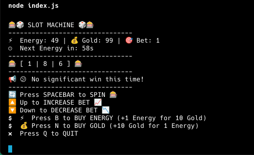

# cli-slot-machine



## English Version

### 🎰 CLI Slot Machine Game

A command-line slot machine game with energy management and dynamic betting system. Features ASCII interface, resource trading, and automatic energy recovery.

### ✨ Features
- Classic 3-reel slot machine mechanics
- Energy system with automatic recovery (1 per minute)
- Adjustable bets (1-15)
- Gold and energy trading system
- Dynamic probability system based on bet size
- Real-time ASCII interface updates
- Win conditions for triple matches and jackpots

### 🛠️ Installation
1. Ensure you have Node.js installed (v14+)
2. Save the script as `index.js`
3. Run using:
```bash
node index.js
```

### 🕹️ How to Play
- Start with 50 Energy and 100 Gold
- Press SPACE to spin
- Adjust bets using Shift+Up/Ctrl+Down
- Trade resources using B/N keys
- Maintain energy balance to keep spinning

### 🎮 Controls
```
SPACE       - Spin
Up    - Increase bet
Down   - Decrease bet
B           - Buy Energy (1⚡ = 10💰)
N           - Buy Gold (10💰 = 1⚡)
Q           - Quit game
```

### 🏆 Game Rules
1. Each spin costs 1 Energy + bet amount in Gold
2. Triple matches give big rewards:
   - 3x 💰 = 50 Gold + 10× bet
   - 3x ⚡ = +10 Energy
3. Single 💰 symbols add bet-sized Gold rewards
4. Energy automatically recovers 1 per minute
5. Max 50 Energy capacity

### ⚙️ Configuration
```js
const SPIN_TIME = 1000;         // Total spin duration
const ENERGY_RECOVERY_TIME = 60000; // 1 minute recovery
const MAX_BET = 15;             // Maximum bet size
const STARTING_ENERGY = 50;     // Initial energy
```

---

## Українська Версія

### 🎰 Слот-машина для командного рядка

Гра-слот-машина з системою енергії та динамічними ставками. Анімований ASCII-інтерфейс, торгівля ресурсами та автоматичне відновлення енергії.

### ✨ Особливості
- Класична 3-барабанна слот-машина
- Система енергії з авто-відновленням (1/хвилину)
- Регульовані ставки (1-15)
- Обмін золота на енергію та навпаки
- Динамічна система ймовірностей на основі ставки
- Інтерфейс з реальним часом
- Умови виграшу за комбінації

### 🛠️ Встановлення
1. Встановіть Node.js (v14+)
2. Збережіть скрипт як `index.js`
3. Запустіть:
```bash
node index.js
```

### 🕹️ Як грати
- Початкові ресурси: 50 Енергії та 100 Золота
- SPACE - крутити барабани
- Змінюйте ставки через Up/Down
- Обмін ресурсів клавішами B/N
- Слідкуйте за балансом енергії

### 🎮 Управління
```
SPACE       - Крутити
Up    - Збільшити ставку
Down   - Зменшити ставку
B           - Купити енергію (1⚡ = 10💰)
N           - Купити золото (10💰 = 1⚡)
Q           - Вийти з гри
```

### 🏆 Правила гри
1. Кожен спін коштує 1 Енергію + ставку у Золоті
2. Три однакові символи дають бонус:
   - 3x 💰 = 50 Золота + 10× ставка
   - 3x ⚡ = +10 Енергії
3. Одиночні 💰 дають бонус у розмірі ставки
4. Енергія відновлюється на 1 щохвилини
5. Максимум 50 Енергії

### ⚙️ Налаштування
```js
const SPIN_TIME = 1000;         // Тривалість обертання
const ENERGY_RECOVERY_TIME = 60000; // Час відновлення
const MAX_BET = 15;             // Макс. ставка
const STARTING_ENERGY = 50;     // Початкова енергія
```

---

**⚠️ Requires Node.js v14+**  
**📌 Press Q to exit**  
**🔄 Game saves state until closed**